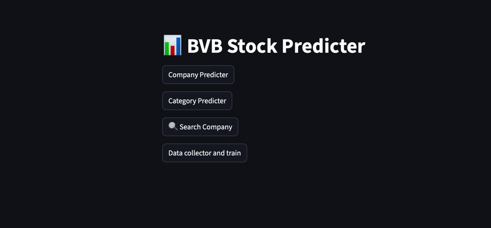
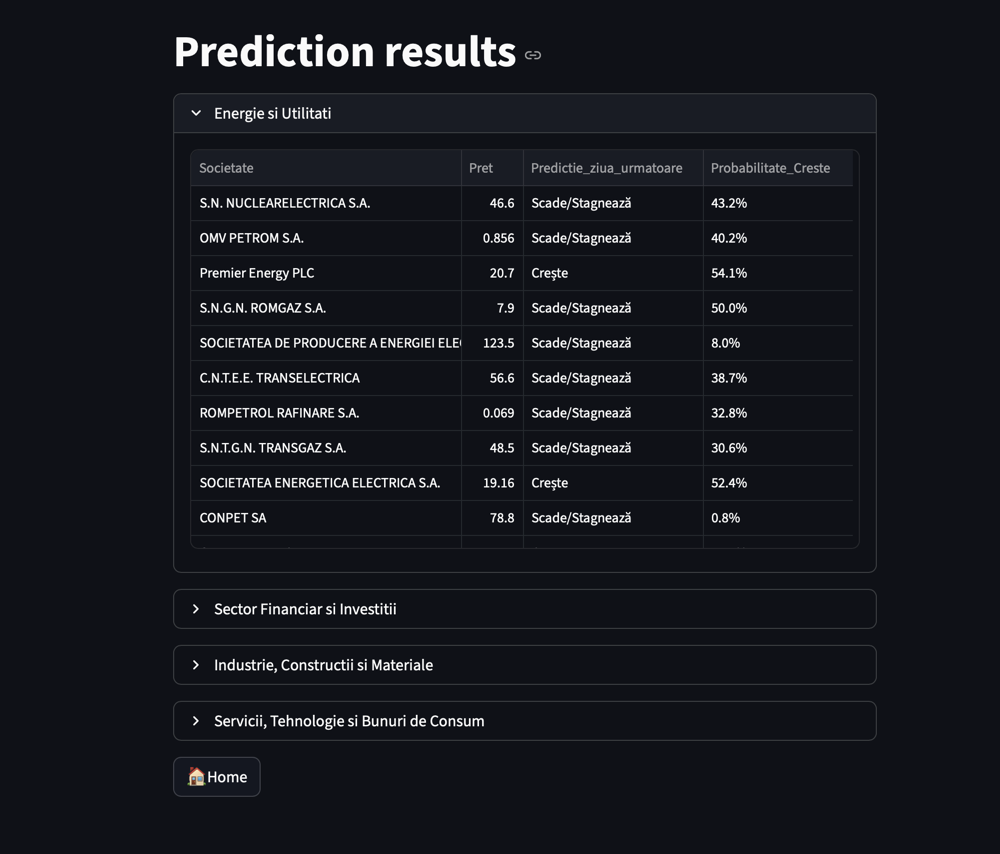
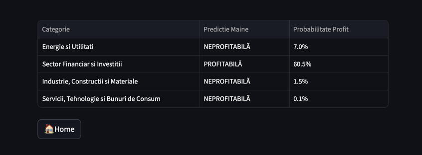
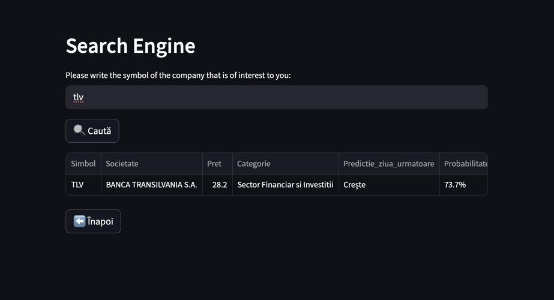
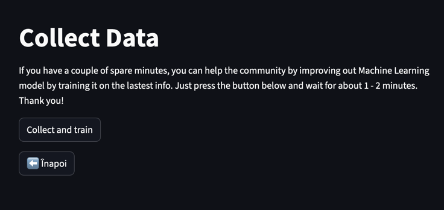

# 1. Idea

The main purpose of this program is to predict whether the stock prices of companies listed on the BVB –  
Bursa de Valori București (Bucharest Stock Exchange) will go up or down.

**DISCLAIMER:** This program was developed for educational purposes only. Any transactions made based on its predictions
are your sole responsibility.

The app is structured of 4 main bodies: data selection, model training, creating predictions and the GUI.

# 2. Data selection

Multiple official and third-party options existed to access BVB (Bucharest Stock Exchange) data, but they all required 
paid subscriptions or licensing. Consequently, I implemented an automated scraper using Playwright to navigate the 
publicly available pages and extract structured data for each listed company. Before getting into details, you need to 
understand how the site is designed. 

The primary link used by the data_selector.py program is https://www.bvb.ro/FinancialInstruments/Markets/Shares, 
which contains a table listing all companies along with basic information such as Symbol, Price, Date, and Price 
Variation. One of the columns, Category, is too generic for predictive purposes. Therefore, I manually reclassified the 
companies into four categories to allow the app to predict which sector is likely to be profitable: Energy and 
Utilities, Financial and Investment, Construction and Materials, and IT and Consumables.

After extracting all the table data, I performed additional scraping for each company. Each company symbol functions as 
a button linking to a dedicated page with more detailed information. The extracted data is then preprocessed into a 
format readable by the predictive model.

Before proceeding to training the model, the data tables are transposed so that rows represent categories and columns represent
all companies with their associated information. Although this is an inefficient way to handle storage, memory 
constraints are negligible in this context, and prioritizing time efficiency was deemed more important.

# 3. Training 

For training, I developed to programs: ml_tmr.py and ml_categoriiV2.py. 

The main purpose of the first program, ml_tmr.py, is to train the model for predicting whether th stock price of a 
company will go up or down. Therefore, I figured that Random Forest Classifier is the one that suits the best for this 
matter since it works best with fluctuating data, non-linear data, it's relatively fast to train and often delivers 
strong predictive performance for tubular financial data. 

The program first reads and concatenates the files into one single data frame. Than it preprocesses data, like column 
are standardized, missing or invalid values are dropped and commas in numeric columns are replaced with periods for 
proper conversion. After the data is ready, it calculates the features (yesterday's price, yesterday's price variation)
and the target (the next day target - 1 if higher, 0 if lower). In the end, The model predicts next-day price movement 
for the most recent data point of each stoc and the trained model is saved as model_companies.joblib for later use.

The second program, overall, has the same idea with one key difference. For this model I used for training Logistic 
regression because the problem is inherently binary classification: a category is either profitable or not on the next
day.

# 4. Predictions

This script, predict_companii.py, uses the previously trained Random Forest model (model_companii.joblib) to predict the
next-day movement of individual stocks. It generates predictions for whether each stock’s price will increase or stay 
the same/decrease and outputs both the prediction and the probability of a price increase. It first automatically
identifies the latest csv file, loads and preprocesses stock price data (converts columns to numerica values and drops 
rows with missing data), creates the features required for this model, loads the trained model and makes predictions. 
The same goes for the script predict_categorii.py.

# 5. GUI

For this I used streamlit. The app first presents itself with 4 options: Company predicter, Category predicter, Search 
company data collector and train.



- Company predicter: First extractst the latest data from BVB and than it predict whether the stock of each company goes
up or down. After pressing the Company predict button, simply press the Predict button and in a few second (it can take 
up to a minute) 4 dropdown tables will appear which represent the companies divided by categories.




- Category predicter: Works the same way as the previous one but the outcome is a table with 4 rows, one for each 
category 




- Search company: simply put a company symbol inside and search for a particular company to see more information about it.
**Disclaimer**: for more accurate prediction for the companies, please run the Company predicter first.




- Data collector and train



# Note

- Python 3.9+
- you will need to manually install the used libraries
- run ``` streamlit run app_dev.py``` for the app to start
